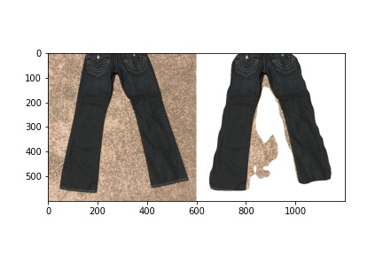
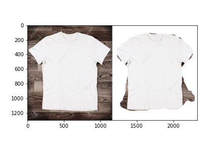
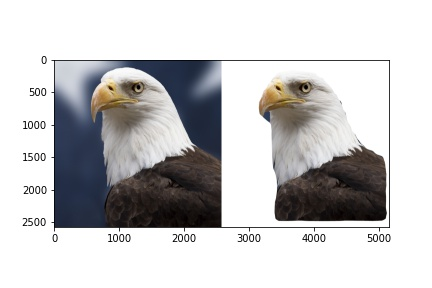

# HAMMOQ-ASSESSMENT

I have used segementation method to rois and masks afterwards with the help of that changed the other pixels to make white background. In this process I have used pre-trained <a href="https://github.com/matterport/Mask_RCNN">Mask-RCNN</a> model. As it is not trained specifically for garments data or images but gives good results. Below are some samples.

